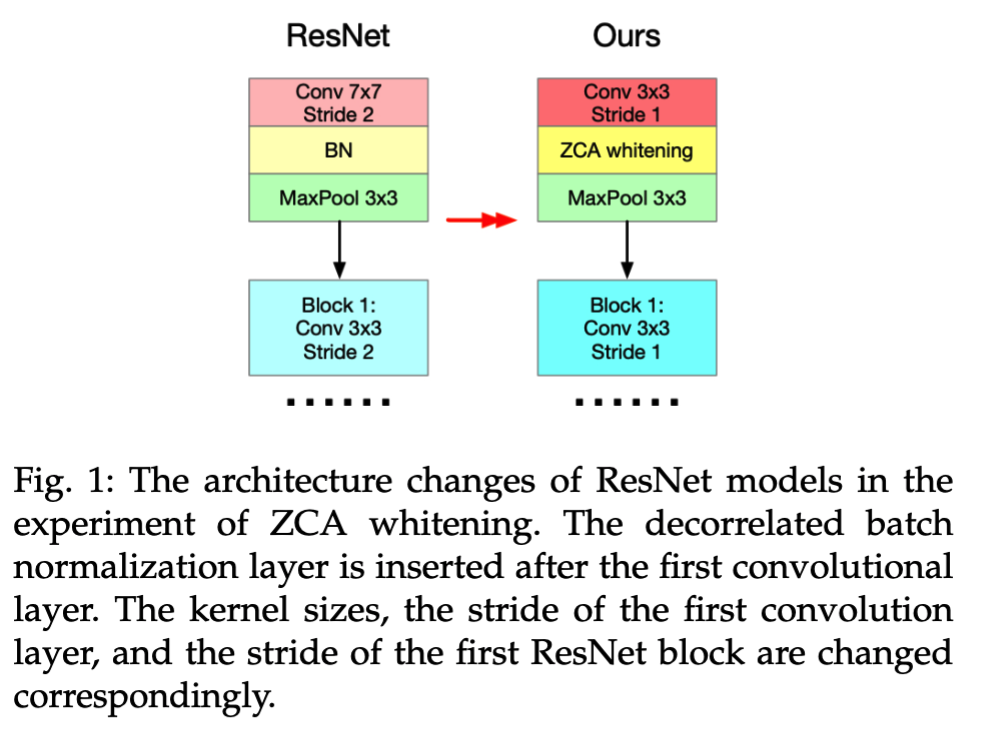

## Introduction

The directory contains the experiment of our method on Decorrelated Batch Normalization. 

We use ResNet-18 and ResNet-50 models and validate on CIFAR10 and CIFAR100.

## Model Architecture

