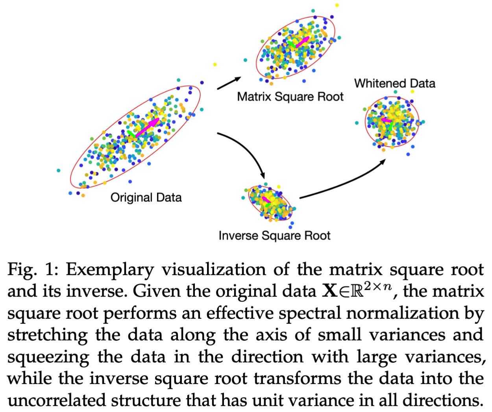

# Fast Differentiable Matrix Sqrt Root

<center></center>

This repository constains the official Pytorch implementation of ICLR 22 paper "Fast Differentiable Matrix Square Root".

## Usages

Check [torch_utils.py](https://github.com/KingJamesSong/FastDifferentiableMatSqrt/blob/main/torch_utils.py) for the implementation.
Minimal exemplery usage is given as follows:

```python
# Import and define function
from torch_utils import *
FastMatSqrt=MPA_Lya.apply
FastInvSqrt=MPA_Lya_Inv.apply

# For any batched matrices, compute their square root or inverse square root:
rand_matrix = torch.randn(5,32,32)
rand_cov = rand_matrix.bmm(rand_matrix.transpose(1,2))
rand_cov_sqrt = FastMatSqrt(rand_cov)
rand_inv_sqrt = FastInvSqrt(rand_cov)
```

## Computer Vision Experiments

All the codes for the following experiments are available: 
- [Decorrelated Batch Normalization (BN)](https://github.com/KingJamesSong/FastDifferentiableMatSqrt/tree/main/Decorrelated%20BN)
- [Second-order Vision Transformer (So-ViT)](https://github.com/KingJamesSong/FastDifferentiableMatSqrt/tree/main/So-ViT)


## Citation

Please consider citing our paper if you think the code is helpful to your research.

```
@inproceedings{song2022fast,
  title={Fast Differentiable Matrix Square Root},
  author={Song, Yue and Sebe, Nicu and Wang, Wei},
  booktitle={ICLR},
  year={2022}
}
```

## Contact

If you have any questions or suggestions, please feel free to contact me

`yue.song@unitn.it`
