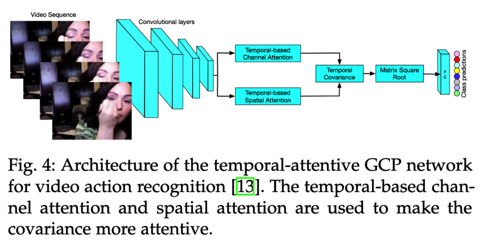

## Introduction 

This directory constains the implementation of our model for video action recognition. 

The codes are based on the official implementation in [TACP](https://github.com/ZilinGao/Temporal-attentive-Covariance-Pooling-Networks-for-Video-Recognition).

## Model Arhictecture

